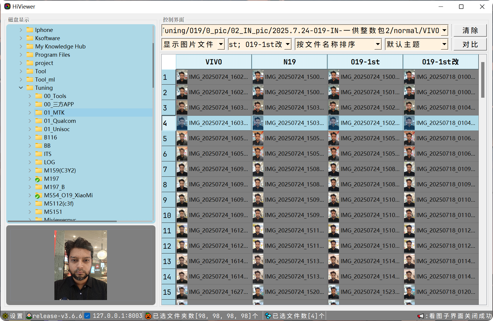
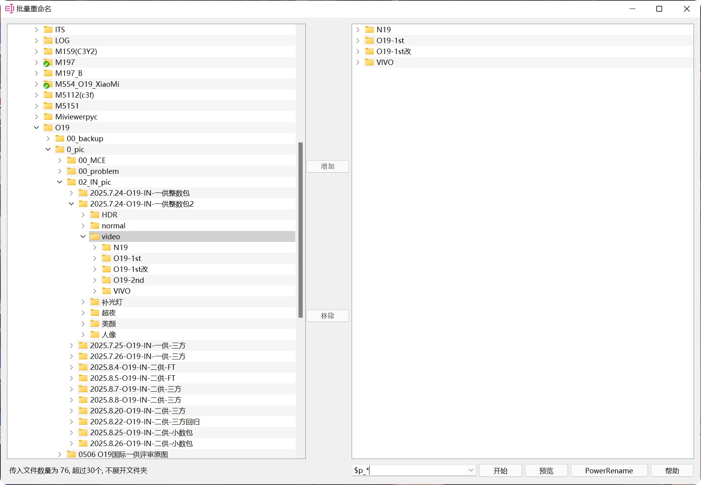
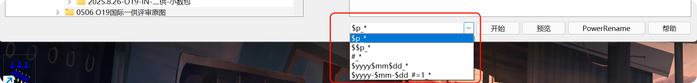
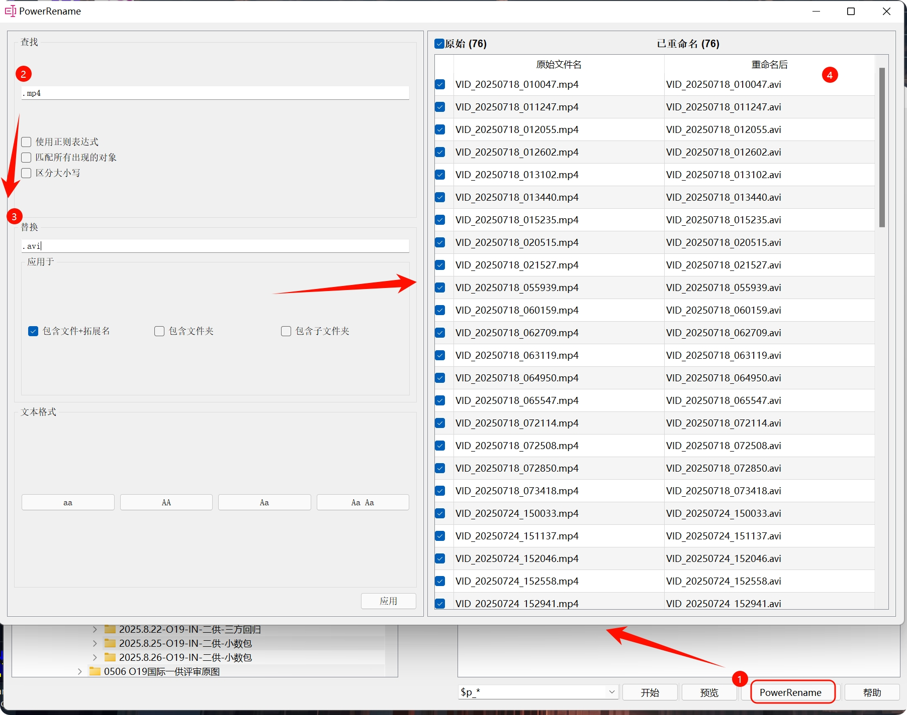

# HiViewer

**专为 Camera Tuning 工程师打造的多功能图片/视频浏览器**

---

## 📖 简介

HiViewer 是一款专为 Camera Tuning 工程师开发的专业图片/视频浏览工具。它不仅支持多图片对比查看和多视频同步播放，还集成了 AI 智能分析、批量文件管理、局域网传输等多种实用功能，大幅提升工作效率。

## ✨ 核心特性

### 🖼️ 图片查看
- **多图对比**：支持同时查看多张图片，方便进行效果对比
- **EXIF 信息解析**：快速查看图片的详细参数信息
- **灵活操作**：支持图片缩放、旋转、拖拽、局部放大等多种操作
- **亮度/ROI 统计**：提供专业的图像统计分析功能

### 🎬 视频播放
- **多视频同步播放**：支持多个视频同时播放并保持同步
- **播放控制**：可调节播放速度、跳帧设置
- **相似帧查找**：快速定位视频中的相似画面

### 🛠️ 实用工具
- **批量重命名**：支持多种命名规则，快速批量重命名文件
- **图片瘦身**：批量压缩图片，支持添加水印
- **文件压缩**：一键压缩并复制到剪贴板，方便分享
- **图片无损旋转**：不丢3A信息旋转图片
- **图片调整**：调整图片的曝光对比度颜色等
- **ADB 脚本管理**：存储常用 ADB 命令，一键执行
- **主题切换**：支持浅色/暗黑主题切换，并提供设置界面可DIY多种主题

## 💻 系统要求

- 操作系统：Windows 10 或更高版本
- 内存：建议 4GB 以上
- 显卡：支持硬件加速的显卡（推荐）

## 🚀 快速开始

### 安装

1. 从 [Releases](https://github.com/yourusername/hiviewer/releases) 页面下载最新版本
2. 解压下载的压缩包
3. 运行 `hiviewer.exe` 启动程序

### 基本使用

1. **打开文件夹**：启动程序后，选择包含图片或视频的文件夹
2. **查看图片**：选中图片文件，点击"对比"按钮打开图片对比界面
3. **对比图片**：选中多张图片，按 `Space` 键和`B` 键打开图片对比界面
4. **播放视频**：在下拉框中启用"显示视频文件"，选中视频后点击"对比"按钮或者按 `Space` 键/`B` 键播放打开多视频播放界面

## 📚 使用指南

## 主界面使用说明

### 1.快捷键使用说明

| 快捷键   | 使用说明                                                                                                                             |
| ---------- | -------------------------------------------------------------------------------------------------------------------------------------- |
| Esc      | 全局功能快捷键<1>退出子界面<2>主界面使用ALT+Q退出                                                                                    |
| Space    | 打开看图子界面并查看下一组图片，打开视频播放子界面并播放视频                                                                         |
| B        | 打开看图子界面并查看上一组图片，打开视频播放子界面并播放视频                                                                         |
| 删除选项 | D:从列表中移除；Ctrl+D:从列表中移除并删除源文件                                                                                      |
| 复制选项 | C:复制文件(按共同文件夹层级)；Ctrl+C:复制文件(按文件)；Ctrl+Shift+C:复制文件路径到剪贴板                                                 |
| 压缩选项 | Z:压缩文件(按共同文件夹层级)；Ctrl+Z:压缩文件(按文件)                                                                                |
| 无损旋转 | 通过调用外部工具API(./hiviewer/resource/tools/jpegr_lossless_rotator/jpegr.exe)来实现无损旋转                                        |
| 按行筛选 | 支持奇数偶数行、3选1、3选2以及5选1等条件进行筛选                                                                                     |
| 图片解析 | I:高通；U:MTK；Y:展锐                                                                                                                |
| 重启程序 | 重新启动hiviewer看图工具                                                                                                             |
| Z        | 压缩当前选中的文件，自定义命名并粘贴到系统剪贴板中，缓存到路径/cache/下                                                              |
| P        | 切换主题,支持可选，浅色：默认主题；深色：暗黑主题                                                                                    |
| X        | 打开图片瘦身工具                                                                                                                     |
| L        | 开图片调整工具                                                                                                                       |
| T        | 截图功能，框选后双击直接复制到剪贴板中，鼠标右键和ESC取消截图；鼠标左键按住移动框选区域                                              |
| M        | 打开ADB命令工具，工具界面支持手动添加常用ADB脚本                                                                                     |
| W        | 打开当前文件所在系统资源管理器中的位置                                                                                               |
| F1       | 打开Raw2Jpg转换工具                                                                                                                  |
| F2       | 获取选中的文件并打开批量重命名工具                                                                                                       |
| F4       | 打开批量重命令工具                                                                                                                   |
| F5       | 刷新选中的文件夹内容                                                                                                                 |
| Ctrl+H   | 查看关于信息                                                                                                                         |
| 其它     | <1>Alt+A:拖拽模式切换，默认支持图片拖拽，按下后禁用拖拽，再次按下重新使能拖拽功能 <2>Alt+I:主界面EXIF信息显示功能全局能快捷键， |
### 2.实用技巧说明

2.1.一键重命名选中的文件并压缩复制到系统剪贴板中，方便发送给其他同学：

- 选中需要重命名的文件，按下快捷键F2，选用需要的命名规则后，按下开始按钮重命名，完成后按下ESC退出返回主界面
- 按下F5刷新表格内容，选中需要压缩的文件，按下快捷键Z，压缩完成后，压缩文件会自动复制到系统剪贴板中
- 直接打开飞书等软件，Ctrl+V粘贴即可发送压缩的文件

2.2.一键切换主题，按下快捷键P，切换暗黑主题，再次按下快捷键P，切换浅色主题（默认主题）

2.3.一键解析图片，支持导入高通、MTK、展锐的工具解析图片3A并在看图子界面展示相关exif信息

2.3.更多实用技巧，待挖掘...

---

## 看图子界面使用说明

### 1. 快捷键使用说明

| 快捷键        | 使用说明                                                                                                                                              |
| --------------- | ------------------------------------------------------------------------------------------------------------------------------------------------------- |
| Space         | 打开看图子界面并查看下一组图片，打开视频播放子界面并播放视频                                                                                          |
| B             | 打开看图子界面并查看上一组图片，打开视频播放子界面并播放视频                                                                                          |
| 鼠标左键      | 按住后拖拽，移动所有图片                                                                                                                              |
| 鼠标右键      | 按住后拖拽，移动单个图片                                                                                                                              |
| 鼠标滚轮      | 对所有图片进行放大缩小；另外，按下V键实现更小粒度的缩小，N键更小粒度的放大                                                                            |
| Ctrl+鼠标滚轮 | 对鼠标指针所在单个图片进行放大缩小                                                                                                                    |
| Ctrl+A        | 向左旋转90度（针对鼠标指针所在图片）                                                                                                                  |
| Ctrl+D        | 向右旋转90度（针对鼠标指针所在图片）                                                                                                                  |
| Ctrl+T        | 打开截图工具，截完后双击，直接将截图粘贴到系统剪贴板中并退出截图界面                                                                                       |
| T             | 打开Camera Test 问题点记录会话框，支持导入EXCEL表格，并记录3A+ISP的问题点                                                                               |
| Q             | 右边图片覆盖到左边（针对两张图片比较的情况）                                                                                                          |
| W             | 左边图片覆盖到右边（针对两张图片比较的情况）                                                                                                          |
| E             | 打开/关闭幻灯片模式                                                                                                                               |
| T             | 打开Camera Test 问题点记录会话框，支持导入EXCEL表格，并记录3A+ISP的问题点                                                                               |
| I             | 打开/关闭设置界面，包含通用设置，颜色设置，显示设置，EXI显示，色彩空间等设置项                                                                              |
| O             | 打开/关闭局部放大模式                                                                                                                             |
| P             | <1>勾选AI提示看图复选框，发起AI请求提示两张图片的差异（只针对两张图片比较的情况） <2>勾选ROI信息并关闭AI提示看图复选框，框选指定区域获取相关信息               |
| F11           | 全屏显示看图                                                                                                                                       |
| ESC           | 全局功能快捷键，可以退出当前界面                                                                                                                      |

### 2. AI提示看图使用说明

1.仅适用于两张图片比较的情况，需要打开AI提示看图复选框，然后按下P键即可发起AI请求

2.当打开AI提示看图复选框时，无法使用ESC退出当前界面，无法使用Space/B键切换图片

3.当关闭AI提示看图复选框时，可以正常使用ESC、Space、B等快捷键功能，P键功能禁用

4.当前P键功能使用的是硅基流动API（deepseekvl2视觉模型）

5.要想体验更完善的功能可以到硅基流动官网 https://cloud.siliconflow.cn/i/yaICNWbd 注册使用

---

## 播放视频子界面使用说明

### 1. 快捷键使用说明

| 快捷键 | 使用说明                              |
| ------ | ------------------------------------- |
| Space  | 打开视频播放子界面并播放视频          |
| B      | 打开视频播放子界面并播放视频          |
| Q      | 暂停/播放 全部视频                    |
| W      | 从头播放  全部视频                    |
| E      | 提高所有视频播放速度，默认1.0倍速播放 |
| R      | 降低所有视频播放速度，默认1.0倍速播放 |
| ESC    | 全局功能快捷键，可以退出当前界面      |

### 2. 其它说明

1.使用播放视频子界面时，需要在主界面下拉框打开显示视频文件，否则无法显示视频文件

2.在主界面选中视频文件时，除了按下SPACE/B键打开视频，还可以按下对比按钮打开视频文件

3.在视频播放子界面，每个视频底下会显示单个视频的进度条和控制按钮（播放速度、跳帧设置，查找相似帧、暂停，从头播放、左旋转90度、右旋转90度）

---

## 批量重命名子界面使用说明

### 1. 快捷键使用说明

| 快捷键 | 使用说明                         |
| ------ | -------------------------------- |
| ESC    | 全局功能快捷键，可以退出当前界面 |

### 2. 其它说明

1.点击帮助按钮会有重命名的使用说明

2.在命名规则下拉框中，预置了常见的规则，选择命名规则后，可以点击预览查看是否符合预期，然后点击开始按钮，即可对文件进行重命名

3.查看替换复选框的使用，具体操作如下图，可以替换文件名中的指定字符

---

## ❓ 常见问题

### Q: 如何启用 AI 图片对比功能？
A: 在看图子界面勾选"AI 提示看图"复选框，然后按 `P` 键即可。需要注册硅基流动 API 并配置密钥。

### Q: 视频文件无法显示怎么办？
A: 请在主界面下拉框中勾选"显示视频文件"选项。

### Q: 如何自动更新到最新版本？
A: 右键菜单 → 关于 → 检查更新，程序会自动下载并安装最新版本。
B：若遇到更新完后工具无法打开的bug，可以尝试手动进入下载路径（hiviewer/downloads/latest.zip）解压latest.zip打开hiviewer.exe
C:若B中尝试仍旧无效，可以邮件反馈bug。

### Q: 支持哪些图片格式？
A: 支持常见的图片格式，包括 JPG、PNG、BMP、RAW 等。

## 📄 许可证

本项目采用 MIT 许可证。详见 [LICENSE](LICENSE) 文件。

## 🙏 致谢

- 感谢所有使用和支持 HiViewer 的用户
- 感谢开源社区的贡献

---

## 📮 联系方式

- 项目主页：[https://github.com/diamond-cz/hiviewer_releases](https://github.com/diamond-cz/hiviewer_releases)
- 问题反馈：[Issues](https://tally.so/r/wgJyJK)
- 邮箱：[diamond_cz@163.com](diamond_cz@163.com)

---

**⭐ 如果觉得 HiViewer 对您有帮助，欢迎给个 Star 支持一下！⭐**

Made with ❤️ for Camera Tuning Engineers

